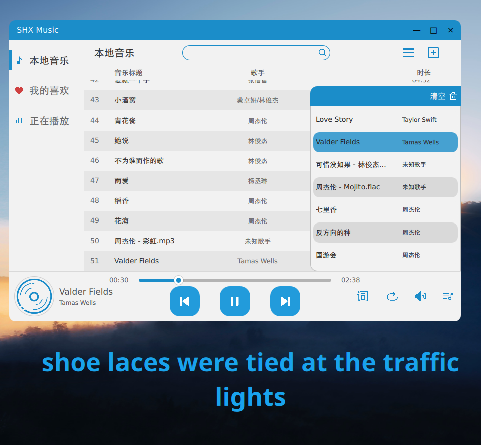
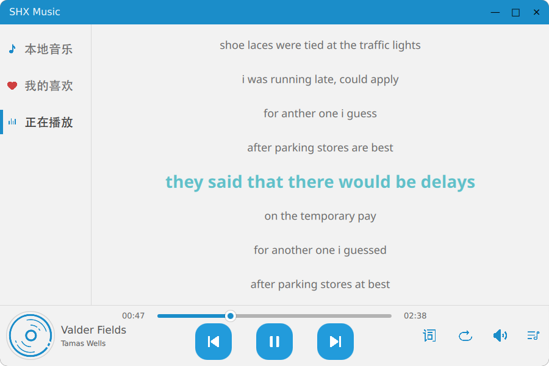

# 一、项目概述

### 项目名称

SHX音乐播放器

### 项目目标

本项目是基于 Qt6开发框架,进行QML和C++混合编程，实现的一个本地音乐播放器。将开发一款轻量、高效的本地音乐播放器，支持主流音频格式，提供简洁直观的交互体验，重点解决本地音乐管理、歌词同步、列表个性化等核心需求，确保跨 Linux 平台兼容性。

----
# 二、开发环境配置

### 开发工具

使用Qt Creator进行开发

### 开发环境

语言：QML , C++, CMAKE

框架：Qt 6.9.1

核心模块：QtMultimedia（音频处理）、QtQuick.Controls（UI 组件）、 taglib库（解析音乐元数据）

平台：Manjaro Linux

----
# 三、核心功能

## 功能概述

核心功能：
1. 本地音频导入（分为导入文件夹或单个音频文件）
2. 音频的元数据读取
3. 音频播放控制（切换歌曲，播放顺序，进度调节，声音调节）
4. 播放列表，本地列表，收藏列表
5. 收藏歌曲
6. 歌词的解析和展示
7. 桌面歌词
8. 搜索歌曲
9. 资源管理，数据存储

## 功能具体实现方法

### 1. 本地音频导入：
使用QFileDialog来导入一个或多个音频文件，用Qdir导入某个文件夹的所有音频文件，文件类型为.mp3 .wav .flac  .ogg
### 2. 音频的元数据读取:
C++编程，从.txt文件读取每首歌的路径，从路径用taglib库来解析音乐源文件，再保存在自己声明的musicmodel类中
### 3. 音频播放控制:
- 通过musicmodel找到所有需要的歌曲的路径，存储到currentList中，查找到当前正在播放的歌曲进行播放控制，使用QtMultimedia来进行音频处理并同步到UI，例如进度调节，播放暂停，声音调节。

- 基础播放状态控制：
  * 播放/暂停：检测MediaPlayer状态：若正在播放则暂停，否则播放当前歌曲
  * 播放指定歌曲： 更新currentIndex为目标索引， 设置MediaPlayer源路径并重置进度后播放
  * 自动播放下一首：监听MediaPlayer.EndOfMedia状态，自动调用下一首

- 上下首切换逻辑：
  * 下一首切换：顺序播放：播放索引的下一个。随机播放：通过do-while生成与当前索引不同的随机索引，并将当前索引存入playHistory进行历史记录。单曲循环：重置当前歌曲进度为 0 并重新播放
  * 上一首切换：顺序播放：播放索引的上一个。随机播放：从playHistory中弹出最后一条记录作为上一首索引。单曲循环同上

- UI 同步与信号交互：
  * 列表 UI 刷新：列表增删后发出刷新信号，确保同步
  * 歌曲详情同步：currentIndex变化时，及时刷新

### 4. 播放列表，本地列表，收藏列表：
三个列表分别有三个musicmodel存储音乐元数据，UI展示元数据中的歌名，歌手等。

- 播放列表操作：
  * 点击按钮添加单首歌曲到当前播放列表：若当前播放列表为空，直接插入并设为第一首，否则插入到当前播放歌曲后，索引 + 1 并刷新列表
  * 双击歌曲添加歌曲到当前播放列表：支持从其他列表（本地 / 收藏）双击添加，空列表时直接替换当前播放列表
  * 删除当前播放列表单首歌曲：若删除当前播放歌曲，自动切换到下一首，若删除索引小于当前索引，当前索引 - 1，并更新到musicmodel
  * 清空当前播放列表：清空musicmodel
  * 播放列表同步机制：每次currentModel发生变化（增删歌曲）后自动调用，确保UI同步，也确保currentList与模型同步

- 本地列表和收藏列表操作：
  * 两个列表的删除操作原理一致：都是通过点击反馈给到当前播放的歌曲，从musicmodel中删除
  * 本地列表的增加音乐：元数据读取后保存到musicmodel中
  * 收藏列表的增加音乐：通过点击获取当前播放的歌曲，将路径传递给收藏列表，添加进musicmodel
  * 本地和收藏列表同步机制：当增删操作过后，自动进行刷新

### 5. 收藏歌曲：
通过点击按钮组件，查找当前播放歌曲的路径，把当前播放路径传递给收藏列表的musicmodel，使其完成收藏
解决可能多次添加同一首歌到收藏列表，导致冗余：添加前，在收藏列表查找该歌曲是否已在列表中，若已在，提示已收藏
### 6. 歌词的解析和展示:
根据当前播放歌曲的路径，自动查找同目录下同名的.lrc文件

- C++ 层：
  * 通过LyricParser类解析 lrc 格式
  * 提取时间标签（如[01:23.45]）和对应歌词内容
  * 将时间标签转换为毫秒，使用QMap<qint64, QString> 来存储时间和歌词
  * 匹配QtMultimedia中的position可以获取当前播放的哪一行

- UI 层：
  * QML 的LyricView通过绑定进度条进度，实时显示匹配的歌词，支持上下滚动动画（当前歌词居中高亮）

### 7. 桌面歌词：
- 通过 Qt.createComponent() 动态创建一个parent为null的Window以避免被主页面窗口最小化等影响
### 8. 搜索歌曲：
- C++编程，匹配歌名或者歌手的关键字来找到歌曲
### 9. 资源管理，数据存储：
- 通过3个txt文件管理资源，在程序初始化时读取，程序关闭时写入歌曲的路径，来做到数据持久化存储，避免存储冗余的元数据

-----
# 四、调试与优化
### 异步加载
- 元数据加载使用异步处理，避免大量歌曲加载时 UI 卡顿
- 列表 UI 使用ListView的懒加载特性，优化大量歌曲场景的内存占用
### 线程隔离
- 音频元数据读取时，独立线程执行，避免阻塞主线程
----
# 五、程序使用方法

进入程序，分为三个区域，左边区域为菜单栏，右边区域为主要界面，底部区域为工具栏

### 1. 菜单栏
* 有本地音乐，我的喜欢，正在播放，三个按钮，其中本地音乐和我的喜欢分别可以打开本地列表和喜欢列表，正在播放可以打开歌词界面
### 2. 主要界面
#### 本地音乐界面
  * 最上方有搜索栏，可以实现关键词搜索，右上方有播放全部和添加音乐的按钮，添加音乐又细分为添加文件和文件夹
  * 中心区域为歌曲列表，歌曲有添加到收藏，添加到当前，删除音乐三个按钮，单击实现功能
  * 双击歌曲可以直接播放歌曲并添加到当前播放列表，若当前播放列表为空，还会一并加载歌曲列表，类似QQ音乐功能
#### 我的喜欢界面
  * 与本地音乐界面功能相似，同上，无添加文件和文件夹功能和添加到收藏功能
#### 正在播放界面
  * 展示当前播放歌曲的歌词，并实现实时滚动，放大当前歌词行
  

### 3. 工具栏
* 左侧为当前播放歌曲信息，中间区域为控制进度，切换上/下一首歌曲，播放/功能，右侧区域分别为，桌面歌词开关、切换当前播放顺序按钮、音量调节按钮、当前播放列表按钮
### 4. 当前播放列表界面
* 点击当前播放列表按钮打开，单击切换歌曲，点“X”把歌曲从当前播放列表移除，界面右上有清空列表按钮
### 5. 桌面歌词界面
* 左上角为锁定按钮，锁定后不可移动且歌词背景保持透明
* 右上角为关闭按钮
* 非锁定状态下，拖动按钮以外的区域可移动桌面歌词
----
# 六、参考资料

* [C++官方文档](https://cppreference.cn/w/)
* [Qt官方文档](https://doc.qt.io/qt-6/zh/qtquick-qmlmodule.html)
* 《QML和Qt Quick快速入门》
----
# 七、开发人员

* 组长：黄昆
* 成员：苏成、谢延盛

